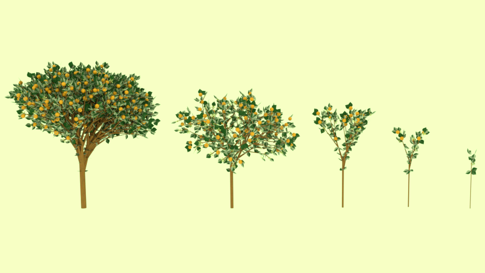
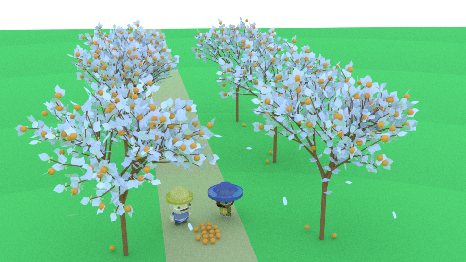

# Orange tree mesh

3D orange tree mesh generator based on L-system with Python and Blender.
[A video can be found on this link](https://www.youtube.com/watch?v=HjxVgBnw1Do), with a 360&deg; rotation animation of the generated 3D orange tree and other scenes.

### Example of scenes

More scenes can be found in the [video](https://www.youtube.com/watch?v=HjxVgBnw1Do). The .blend file used for the farmer scene can be found in the blender.zip file.

(Credits to linyang for the farmer models 'resources/source/2 farmers.fbx':
https://sketchfab.com/linyang/collections/character)

## L-system

An L-system, or Lindenmayer system is a type of formal grammar used to model the growth processes of plant or bacteria.

L-system consists of an axiom defining the string to start with, and production rules. It is then translated into geometric structures.

### Implementation

We have implemented the parametric OL-system that operates on parametric words, using parameters representing logical expression and arithmetic expression.

### Rendering

Python scripts are used in Blender to generate geometric structures, with the 'bpy' library.

### Objects

For tree trunks, primitive cone meshes were used, and for oranges, primitive UV sphere meshes.

Trunks and branches are cones generated from two coordinates and two radius. Since the radius decreases each time, the bumps in between the cones were very visible. We tried to apply the Laplacian Smooth object modifier, but it didn't give a satisfying result. Thus, we decided to join all the collinear vectors. In this way, we would only have one cone for each direction.
